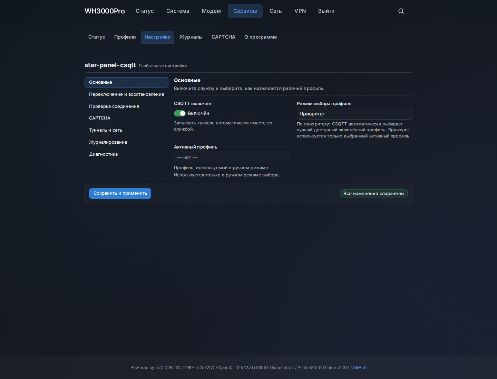
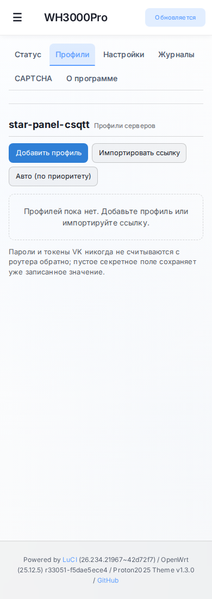
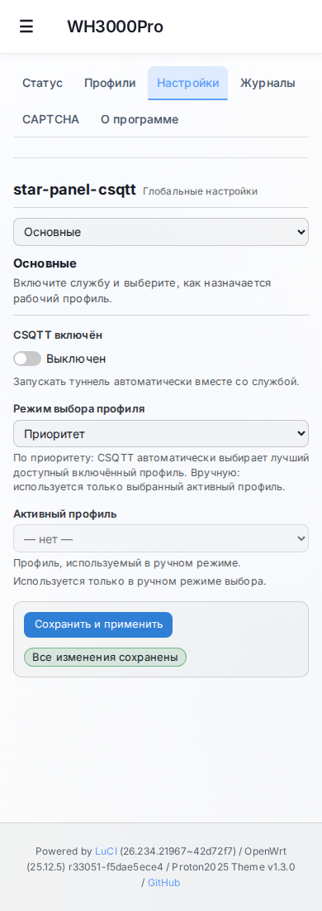

# star-panel-csqtt

Пакет **CSQTT** для роутеров на **OpenWrt 25.12.x** (`apk`), архитектура
`aarch64_cortex-a53` (ARM64 Cortex-A53). Это интеграция в OpenWrt и панель
LuCI для ядра CSQTT.

## Версии

| Компонент | Версия |
|---|---|
| Пакет для OpenWrt (`csqtt`) | **1.0** |
| Панель LuCI (`luci-app-csqtt`) | **1.0** |
| Встроенное ядро CSQTT (`csqtt-core`) | **2.1.9** |

Ядро — оригинальный CSQTT (focsq-совместимое) и не переименовывается в 1.0.
Версия ядра отображается на странице **О программе** в LuCI.

## Что это даёт

- Профильный пул: автопереключение при сбое (failover), возврат (failback),
  приоритеты, cooldown и reconnect.
- Health-контроль (`transport` / `data` / `both`), пороги, интервал проверки.
- Две схемы авторизации VK: `vkcalls` (по хешам звонка) и `auto_js`
  (по VK access-токену — хеши не нужны).
- Воркеры `9..126` (кратно 9), обфускация `audio` / `video`, TURN `udp` / `tcp_tls`.
- CAPTCHA: встроенный решатель и локальный Web Helper (страница для телефона в LAN).
- LuCI: Status / Profiles / Settings / Logs / CAPTCHA / About, русский интерфейс.
- Секреты (`password`, `vk_js_token`) — write-only: в интерфейс, статус и логи
  не выводятся.

> Стабильность зависит от сети, сервера и настроек. Проект не гарантирует
> бесперебойную работу и не является средством обхода законодательства.

## Скриншоты

Демонстрационные данные, без личных адресов и токенов.

**Профили** — компактные карточки со статусом, переключателем и действиями:


**Настройки** — категории, панель с пояснением и состояния сохранения:



На узких экранах (телефон) страницы перестраиваются:




## Требования

- Роутер на OpenWrt 25.12.x с менеджером пакетов `apk`, архитектура
  `aarch64_cortex-a53`.
- Доступ в интернет для установки зависимостей из репозитория OpenWrt.
- Данные от вашего сервера CSQTT: ссылка подключения `csqtt://…`.
- Для режима `auto_js` — VK access-токен (см. ниже).

## Установка

### Автоматически (скрипт)

```sh
wget --no-proxy -qO- https://github.com/starkugz/star-panel-csqtt/raw/refs/heads/main/install-csqtt.sh | ash
```

Скрипт ставит пакеты и зависимости, делает резервную копию конфигурации и
проверяет, что все обязательные зависимости установлены.

### Вручную (файлами из Release)

1. Скачайте из раздела **Releases**:
   `csqtt_1.0.0_aarch64_cortex-a53.apk`, `luci-app-csqtt_1.0.0_all.apk`,
   `luci-i18n-csqtt-ru_all.apk`, `SHA256SUMS`.
2. Проверьте целостность: `sha256sum -c SHA256SUMS`.
3. Установите:

```sh
apk update
apk add --allow-untrusted \
  /tmp/csqtt_1.0.0_aarch64_cortex-a53.apk \
  /tmp/luci-app-csqtt_1.0.0_all.apk \
  /tmp/luci-i18n-csqtt-ru_all.apk
```

`--allow-untrusted` нужен, потому что пакеты собраны локально и не подписаны
ключом репозитория OpenWrt. Зависимости (`kmod-tun`, `luci-base`,
`rpcd-mod-ucode`, `ucode-mod-socket`, `coreutils-timeout`) `apk` подтянет из
официального репозитория.

## Быстрый старт

1. Откройте LuCI → **Службы → star-panel-csqtt**.
2. **Profiles → Import link** (или **Add profile**) и заполните поля:
   - **Server / Peer** — адрес сервера `host:port` (обычно приходит со ссылкой);
   - **Password** — пароль подключения (приходит со ссылкой);
   - **VK hashes / links** — для режима `vkcalls` (хеши или ссылки `vk.com/call/join`).
3. Для режима `auto_js` («ссылка без хешей»): импортируйте ссылку **без**
   отметки **Activate**, откройте профиль (**Изменить**) и укажите
   **Advanced → VK auth mode = Auto JS**, **VK hash mode = Auto JS**,
   **VK JS token** = токен или полный OAuth redirect-URL. Затем сохраните.
   (Отметка **Activate** при импорте рассчитана на ссылку с VK-хешами; без хешей
   профиль нельзя включить, пока не задан токен.)
4. Включите профиль (тумблер **Profile enabled**).
5. Включите службу: **Settings → CSQTT enabled = on**, затем при необходимости
   **Start** на странице Status (или `uci set csqtt.main.enabled='1'; uci commit csqtt`).
6. Проверьте: **Status** — служба запущена, соединение установлено, идёт трафик.
7. Чтобы направить трафик в туннель, настройте пользовательский прокси
   (Mihomo/ssclash) на `csqtt0` — см. «Использование туннеля».

Автозапуск: пакет регистрирует службу, и OpenWrt при установке включает её
init-скрипт. Пока `main.enabled='0'`, служба работает вхолостую и туннель не
поднимает. Автозапуск можно выключить: `/etc/init.d/csqtt disable`.

## Ссылка CSQTT и VK-токен — это разные вещи

- **Ссылка подключения `csqtt://…`** содержит адрес сервера, порт и пароль
  (и, в форме v2, возможно, список VK-хешей). Её выдаёт владелец сервера.
  В LuCI она вставляется кнопкой **Import link** либо разносится по полям
  вручную.
- **VK-токен** нужен только для режима `auto_js`. Это отдельный секрет VK, а не
  часть ссылки. В LuCI у него отдельное поле **VK JS token**.

Не вставляйте токен в поле ссылки и наоборот.

## Как получить VK-токен

Подходит **implicit-flow** (VK OAuth) для приложения с доступом к звонкам.
Например, через сервис `https://vkhost.github.io/`: выберите приложение,
разрешите доступ и скопируйте из адресной строки часть **от `access_token=` до
`&expires_in`**. Инструкция внешнего сервиса может меняться — проверяйте её
актуальность на самом сервисе.

Поле **VK JS token** принимает оба варианта:

- сам токен (обычно начинается с `vk1.`);
- **полный redirect-URL** целиком, например
  `https://oauth.vk.ru/blank.html#access_token=vk1.a…&expires_in=…&user_id=…`.

LuCI и служба CSQTT сами извлекут параметр `access_token`/`token`, декодируют
URL-кодирование и уберут пробелы по краям. Если в поле вставить произвольный
текст, который не является токеном, LuCI сообщит об ошибке, а клиент не станет
отправлять его на сервер.

> **Токен и полный OAuth redirect-URL — это секреты.** Не публикуйте их, не
> пересылайте в мессенджерах и не вставляйте в тикеты. При подозрении на утечку
> отзовите токен и получите новый.

## Проверка: служба, соединение, трафик

На странице **Status** показаны три независимых признака:

- **Служба** — запущена / не запущена (процесс CSQTT);
- **Соединение** — установлено / нет (есть рабочая сессия с сервером);
- **Передача данных** — «трафик подтверждён» / «трафика пока нет»
  (счётчики RX/TX больше нуля).

Запущенная служба и активный профиль сами по себе **не доказывают** передачу
данных: нужен реальный запрос. Проверить вручную:

```sh
csqtt status           # активный профиль, состояние, счётчики
csqtt doctor           # read-only диагностика (конфиг, TUN, peer, rp_filter)
ip -4 addr show csqtt0 # адрес интерфейса
# пробный HTTPS-запрос именно через туннель:
curl --interface csqtt0 --max-time 15 https://1.1.1.1/cdn-cgi/trace
```

Если внешний IP в ответе совпадает с IP сервера CSQTT (а не с вашим WAN) —
трафик действительно идёт через туннель.

## interface-only: что это значит

CSQTT не становится шлюзом по умолчанию и **не меняет** маршруты, правила,
таблицы, системный DNS/dnsmasq, firewall и NAT. Поднимается только
TUN-интерфейс `csqtt0`. Через него идёт **только** трафик процессов, явно
привязанных к интерфейсу.

Поэтому установка CSQTT сама по себе **не направляет весь домашний интернет**
через туннель. Нужен пользовательский прокси, который привязывает исходящие
соединения к `csqtt0`.

## Использование туннеля (Mihomo / ssclash)

CSQTT не трогает маршруты. Направление трафика выполняет прокси привязкой к
интерфейсу (`SO_BINDTODEVICE`). Пример правила для Mihomo:

```yaml
proxies:
  - name: CSQTT
    type: direct
    interface-name: csqtt0
    udp: true
```

`ssclash` (`https://github.com/zerolabnet/SSClash/`) поддерживает ту же связку.
Настройка прокси — на стороне пользователя; в пакет она не входит.

## LuCI: страницы

- **Status** — три признака (служба/соединение/трафик), активный профиль,
  счётчики, кнопки Start / Stop / Restart, последняя ошибка.
- **Profiles** — список серверов, добавление и редактирование (в т.ч. advanced:
  `vk_auth_mode`, `vk_hash_mode`, `vk_js_token`), импорт/экспорт ссылки
  `csqtt://`, QR, **Check hashes**.
- **Settings** — глобальные параметры: failover/failback, health, CAPTCHA,
  логирование, routing.
- **Logs** — журнал `/var/log/csqtt.log` (хвост, обновление, очистка).
- **CAPTCHA** — активные задачи, отмена, ссылка и QR для Web Helper.
- **About** — версии пакета, панели и ядра, автор редакции, лицензия и
  обязательные уведомления.

Полное описание параметров — в [`docs/CONFIG.md`](docs/CONFIG.md).

## Если не работает

| Симптом | Возможная причина | Безопасная проверка | Действие |
|---|---|---|---|
| В статусе/логе `API 5: User authorization failed` | VK отклонил авторизацию: токен недействителен, истёк/отозван, скопирован от другого аккаунта/приложения, либо в поле не токен | `csqtt status` → `last_error`; проверьте поле **VK JS token** | Получите новый токен или используйте режим `vkcalls` с VK-хешами. Убедитесь, что в поле вставлен токен/redirect-URL, а не ссылка сервера |
| Служба «не запущена» | `main.enabled='0'` или автозапуск не включён | `uci get csqtt.main.enabled`; `ls /etc/rc.d/*csqtt*` | `uci set csqtt.main.enabled='1'; uci commit csqtt; /etc/init.d/csqtt enable; /etc/init.d/csqtt start` |
| Профиль выключен, соединения нет | `server.<id>.enabled='0'` | `uci show csqtt \| grep enabled` | Включите профиль в LuCI (Profiles) или `uci set csqtt.<id>.enabled='1'; uci commit csqtt` |
| Нет интерфейса `csqtt0` | Служба не запущена, профиль не подключился, либо не загружен модуль TUN | `ip link show csqtt0`; `csqtt doctor` | Устраните причину по `doctor`; при необходимости `modprobe tun` и перезапустите службу |
| `FATAL_HANDSHAKE` / handshake timeout | Неверный пароль подключения или несовместимость с сервером | `csqtt doctor`; сверьте `peer` и `password` со ссылкой | Импортируйте ссылку заново; проверьте, что сервер доступен |
| Соединение активно, но трафика нет | Пользовательский прокси не привязан к `csqtt0`; интернет идёт мимо туннеля | `curl --interface csqtt0 …` (см. выше); `csqtt status` счётчики | Настройте Mihomo/ssclash на `interface-name: csqtt0` |
| Периодические тайм-ауты при активном соединении | `obfs`/`workers` не подходят серверу или каналу | `csqtt status` (`state=active`, счётчики растут, но отдельные запросы висят) | Подберите `obfs` (`audio`/`video`) и `workers` по рекомендации владельца сервера; в проверенной конфигурации стабильно `video`/36 |
| `doctor` показывает `peer-reachability: warn` | Сервер не отвечает на пробу, но соединение может работать | Сравните с рабочим подключением; перепроверьте `peer` | Если и соединения нет — проверьте адрес/порт и firewall у сервера |
| `rp_filter=1` на `csqtt0` режет обратный трафик | Строгий режим ядра | `cat /proc/sys/net/ipv4/conf/csqtt0/rp_filter` | `sysctl -w net.ipv4.conf.csqtt0.rp_filter=2` (настройка системы, не службы) |

Логи и диагностика:

```sh
csqtt status            # 0 подключён / 1 нет / 2 служба не запущена
csqtt doctor --json     # машинно-читаемая диагностика
csqtt log tail -n 50 -f # журнал с маскировкой секретов
logread -e csqtt        # системный лог
```

Секреты в логах и статусе маскируются; не публикуйте вывод, если сами добавили
в него токен.

## Обновление и удаление

Обновление — установкой новых `.apk` из Release (конфигурация в
`/etc/config/csqtt` сохраняется как conffile):

```sh
apk add --allow-untrusted /tmp/csqtt_<новая>_aarch64_cortex-a53.apk \
  /tmp/luci-app-csqtt_<новая>_all.apk /tmp/luci-i18n-csqtt-ru_all.apk
/etc/init.d/csqtt restart
```

Переход с более старой **несовместимой по схеме** версии (например, 2.1.9 → 1.0)
`apk` выполняет как понижение версии; автоматический установщик добавляет
безопасный откат (удаление пакетов с сохранением конфигурации и повторная
установка). Перед сменой схемы версий сделайте резервную копию
`/etc/config/csqtt`.

Удаление:

```sh
/etc/init.d/csqtt stop
/etc/init.d/csqtt disable
apk del luci-app-csqtt csqtt
# конфигурация остаётся (conffile); полное удаление:
rm -f /etc/config/csqtt
```

## Известные ограничения

- Поддерживается только `aarch64_cortex-a53` и OpenWrt 25.12.x (`apk`).
- Только **interface-only**: без пользовательского прокси на `csqtt0` весь
  трафик остаётся вне туннеля.
- `auto_js` требует действующего VK-токена с доступом к звонкам; токен имеет
  срок жизни.
- Пакеты не подписаны ключом репозитория OpenWrt — установка с
  `--allow-untrusted`.

## Сборка из исходников

См. [`docs/UPDATE.md`](docs/UPDATE.md) и [`docs/RELEASE.md`](docs/RELEASE.md).
Кратко (Linux/WSL, нужен OpenWrt SDK и Rust с target `aarch64-unknown-linux-musl`):

```sh
sh scripts/build-all.sh
sh scripts/verify-release.sh
```

## Лицензия и атрибуция

PolyForm Noncommercial License 1.0.0 — см. [`LICENSE`](LICENSE). Только
некоммерческое использование.

> Required Notice: Copyright 2026 amurcanov

Ядро CSQTT и исходный проект созданы **amurcanov** (и соавторами, см.
[`NOTICE.md`](NOTICE.md)). Эта редакция (`star-panel-csqtt`) добавляет
интеграцию в OpenWrt и панель LuCI; изменения распространяются на тех же
условиях. Исходное ядро не выдаётся за собственную разработку.
