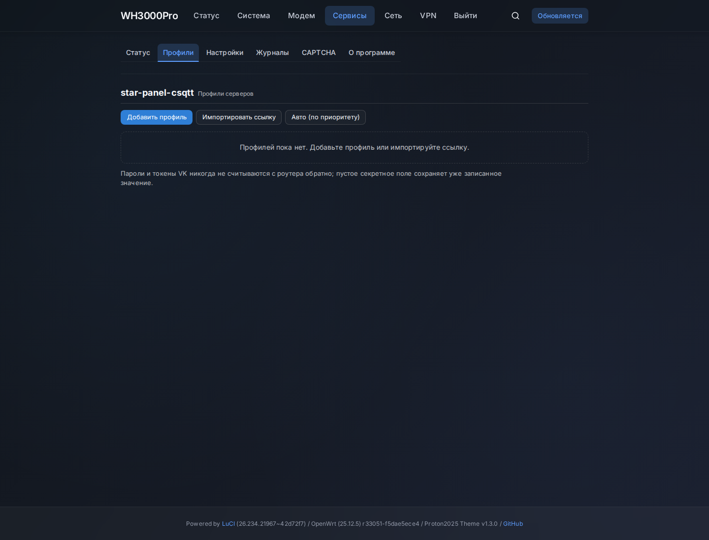

# star-panel-csqtt

Пакет **CSQTT** для роутеров на **OpenWrt 25.12.x** (`apk`), архитектура
`aarch64_cortex-a53`. Устанавливает на роутер службу CSQTT (`/usr/bin/csqtt`) и
панель управления LuCI.

CSQTT работает **interface-only**: поднимается только интерфейс `csqtt0`; маршруты,
системный DNS, firewall и NAT не изменяются. Трафик в туннель направляет
пользовательский прокси (например, Mihomo или ssclash) привязкой
`interface-name: csqtt0`.

**[Скачать последнюю версию](https://github.com/starkugz/star-panel-csqtt/releases/latest)**
· [Все выпуски](https://github.com/starkugz/star-panel-csqtt/releases)

## Версии

| Компонент | Версия |
|---|---|
| Пакет для OpenWrt (`csqtt`) | **1.0.0** |
| Панель LuCI (`luci-app-csqtt`) | **1.0.0** |
| Встроенное ядро CSQTT (`csqtt-core`) | **2.1.9** |

Ядро — оригинальный CSQTT и не переименовывается в 1.0. Версия ядра отображается
на странице «О программе» в LuCI.

## Возможности

- Профильный пул: автопереключение (failover), возврат (failback), приоритеты,
  cooldown и повторные подключения.
- Health-контроль (`transport` / `data` / `both`), пороги, интервал проверки.
- Авторизация VK: `vkcalls` (VK-хеши и ссылки `vk.com/call/join`) и `auto_js`
  (по VK access-токену).
- Воркеры `9..126` (кратно 9), обфускация `audio` / `video`, TURN `udp` / `tcp_tls`.
- CAPTCHA: встроенный решатель и локальный Web Helper (страница для телефона в LAN).
- LuCI: Status / Profiles / Settings / Logs / CAPTCHA / About, русский перевод.
- Секреты (`password`, `vk_js_token`) — write-only: в интерфейс, статус и логи не
  выводятся.

## Скриншоты

Демонстрационные данные, без личных адресов и токенов.

Профили:



Настройки:


## Требования

- Роутер на OpenWrt 25.12.x с менеджером пакетов `apk`, архитектура
  `aarch64_cortex-a53`.
- Доступ в интернет для установки зависимостей из репозитория OpenWrt.
- Данные сервера CSQTT: ссылка подключения `csqtt://…`. Для режима `auto_js` —
  VK access-токен.

## Установка

### Автоматически (скрипт)

```sh
wget --no-proxy -qO- https://github.com/starkugz/star-panel-csqtt/raw/refs/heads/main/install-csqtt.sh | ash
```

Скрипт определяет последний выпуск (или берёт заданный `CSQTT_VERSION=<тег>`),
скачивает пакеты выбранного выпуска, сверяет SHA256 каждого из трёх APK,
проверяет платформу, свободное место и зависимости, делает резервную копию
конфигурации и только затем ставит пакеты. При любой ошибке до установки пакеты и
конфигурация не изменяются.

Конкретный выпуск:

```sh
wget --no-proxy -qO- https://github.com/starkugz/star-panel-csqtt/raw/refs/heads/main/install-csqtt.sh | CSQTT_VERSION=v1.0.0 ash
```

### Вручную (файлы из Release)

Скачайте из раздела [Releases](https://github.com/starkugz/star-panel-csqtt/releases):

- `csqtt_1.0.0_aarch64_cortex-a53.apk`
- `luci-app-csqtt_1.0.0_all.apk`
- `luci-i18n-csqtt-ru_all.apk`
- `SHA256SUMS` — для проверки

```sh
sha256sum -c SHA256SUMS
apk update
apk add --allow-untrusted ./csqtt_1.0.0_aarch64_cortex-a53.apk ./luci-app-csqtt_1.0.0_all.apk ./luci-i18n-csqtt-ru_all.apk
```

`--allow-untrusted` нужен, потому что пакеты собраны локально и не подписаны ключом
репозитория OpenWrt.

## Первоначальная настройка

1. Откройте LuCI → **Службы → star-panel-csqtt**.
2. **Профили → Импортировать ссылку** — вставьте ссылку `csqtt://…` (адрес и
   пароль); либо заполните поля вручную.
3. Для режима `auto_js` («ссылка без хешей») импортируйте ссылку **без** отметки
   **Активировать**, откройте профиль (**Изменить**) и укажите
   **Расширенные → Режим авторизации VK = Auto JS**, **Режим хешей VK = Auto JS**,
   **VK JS token** — сам токен или полный OAuth redirect-URL. Затем сохраните.
4. Включите профиль, затем службу: **Настройки → CSQTT включён** и при
   необходимости **Запустить** на странице **Статус** (или
   `uci set csqtt.main.enabled='1'; uci commit csqtt`).
5. Проверьте **Статус**: служба запущена, соединение установлено, идёт трафик.
6. Чтобы направить трафик в туннель, настройте прокси на `csqtt0` (Mihomo/ssclash,
   `interface-name: csqtt0`). Без прокси весь трафик остаётся вне туннеля.

Автозапуск: пакет регистрирует и включает init-скрипт при установке; туннель не
поднимается, пока `main.enabled='0'`. Отключить автозапуск — `/etc/init.d/csqtt disable`.

### Как получить VK-токен

Токен нужен только для режима `auto_js`. Его получают implicit-flow авторизацией
VK для приложения с доступом к звонкам. Например, через сервис
[vkhost.github.io](https://vkhost.github.io/): выберите приложение, разрешите
доступ и скопируйте из адресной строки часть **от `access_token=` до
`&expires_in`**.

Поле **VK JS token** принимает и сам токен (обычно начинается с `vk1.`), и
**полный redirect-URL** целиком — LuCI и служба сами извлекут параметр
`access_token`/`token`, декодируют URL-кодирование и уберут пробелы по краям.

Если в статусе или логе `API 5`, токен отклонён: проверьте, что вставлен именно
токен, и при необходимости получите новый.

> Токен и полный OAuth redirect-URL — секреты: не публикуйте их и не пересылайте.
> Внешний сервис может менять порядок получения — проверяйте его актуальность.

## Обновление

Установщик подходит и для обновления: он сохраняет `/etc/config/csqtt`
(резервная копия с правами только для root), состояние включения службы и не
удаляет пакеты при ошибке.

```sh
# последний выпуск
wget --no-proxy -qO- https://github.com/starkugz/star-panel-csqtt/raw/refs/heads/main/install-csqtt.sh | ash
# или конкретный выпуск
CSQTT_VERSION=v1.0.0 sh install-csqtt.sh
```

Смена схемы версий (2.1.9 → 1.0.0) — это понижение номера пакета; `apk` обычно
выполняет его сам. Если прямая замена не удаётся, установщик переходит к удалению
и повторной установке **только** при наличии проверенных пакетов установленной
версии для восстановления (каталог `CSQTT_ROLLBACK_DIR` или `/tmp/csqtt-rollback`);
иначе он останавливается и пакеты не трогает. Резервная копия одного конфига не
является откатом пакетов.

## Удаление

```sh
/etc/init.d/csqtt stop
/etc/init.d/csqtt disable
# пакеты удаляются в порядке зависимостей:
# luci-i18n-csqtt-ru зависит от luci-app-csqtt, а тот — от csqtt.
for p in luci-i18n-csqtt-ru luci-app-csqtt csqtt; do
    apk info -e "$p" >/dev/null 2>&1 && apk del "$p"
done
# конфигурация остаётся (conffile); полное удаление:
rm -f /etc/config/csqtt
```

## Если не работает

- **Служба не запускается.** `csqtt doctor` (диагностика), затем
  `/etc/init.d/csqtt start`; проверьте `uci get csqtt.main.enabled` (= `1`) и
  включённый профиль. Логи: `csqtt log tail -n 50`.
- **Ошибка авторизации (в статусе/логе `API 5`).** Токен отклонён: в LuCI
  Profiles откройте профиль, задайте `VK auth mode = Auto JS`,
  `VK hash mode = Auto JS` и вставьте действующий токен (или полный OAuth
  redirect-URL), сохраните профиль. Либо используйте режим `vkcalls` с VK-хешами.
- **Соединение есть, а трафика нет.** CSQTT работает только на интерфейсе: нужен
  прокси на `csqtt0` (`interface-name: csqtt0`). Проверка —
  `curl --interface csqtt0 https://1.1.1.1/cdn-cgi/trace`; если внешний IP равен
  IP сервера CSQTT, туннель работает.

## Известные ограничения

- Поддерживается только `aarch64_cortex-a53` и OpenWrt 25.12.x (`apk`).
- Только interface-only: без пользовательского прокси на `csqtt0` весь трафик
  остаётся вне туннеля.
- `auto_js` требует действующего VK-токена с доступом к звонкам.
- Пакеты не подписаны ключом репозитория OpenWrt — установка с `--allow-untrusted`.

## Лицензия и атрибуция

PolyForm Noncommercial License 1.0.0 — см. [`LICENSE`](LICENSE). Только
некоммерческое использование.

> Required Notice: Copyright 2026 amurcanov

Ядро CSQTT и исходный проект созданы **amurcanov** (и соавторами, см.
[`NOTICE.md`](NOTICE.md)). Редакция **star-panel-csqtt** добавляет интеграцию в
OpenWrt и панель LuCI; изменения распространяются на тех же условиях. Исходное ядро
не выдаётся за собственную разработку.
